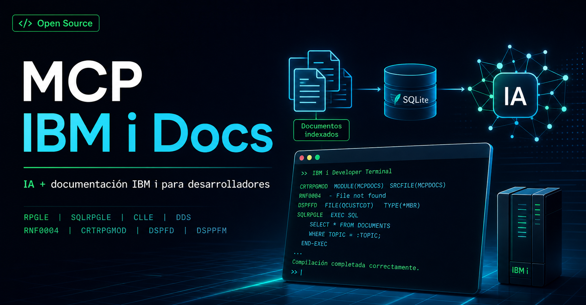

# MCP IBM i Docs

> [!WARNING]
> **Release 2.0.1.** MCP IBM i Docs ya está listo para uso comunitario, con instalación npm, CLI, servidor MCP y recuperación documental local. La versión 2 elimina las APIs internas síncronas/decorativas y usa un único núcleo neuronal asíncrono; el parche 2.0.1 estabiliza la recuperación multievidencia entre plataformas. Sigue siendo un proyecto open source en evolución: si encuentras casos raros, gaps de corpus o respuestas mejorables, abre un issue o PR.

<p align="center">
  
</p>

MCP comunitario para que agentes de IA consulten documentación IBM i / AS400 desde un corpus local antes de responder sobre RPGLE, SQLRPGLE, CLLE, DDS, comandos, mensajes y Db2 for i.

La idea es simple: menos “creo que era así” y más “lo contrasté contra documentación IBM i indexada”. El AS/400 ya trae suficiente mística; no hace falta añadirle alucinaciones con corbata.

## Qué problema resuelve

Los modelos generalistas suelen recordar IBM i de forma irregular: mezclan releases, comandos, parámetros de compilación, mensajes RNF o detalles de DDS. Este MCP agrega una capa local de evidencia documental para que el agente pueda buscar, leer y citar contexto antes de ayudarte.

Sirve para:

- explicar comandos como `CRTRPGMOD`, `CRTSQLRPGI` o `SND-MSG`;
- revisar código RPGLE, SQLRPGLE, CLLE o DDS;
- diagnosticar mensajes documentados como `RNF5393`;
- comparar documentación entre IBM i 7.3, 7.4, 7.5 y 7.6;
- preparar contexto compacto para Codex u otros clientes MCP.

## Lo importante en 30 segundos

- **No necesitas RDi instalado** para usar el MCP.
- **No usa Eclipse Help en runtime**.
- **No depende de endpoints locales de RDi** ni de servicios temporales de bootstrap.
- El paquete npm instala el servidor y la CLI; durante `postinstall` descarga los **assets compatibles declarados en `runtime-assets.json`**, verifica su integridad e instala el data pack y los modelos localmente.
- El corpus documental vive en SQLite con vectores semánticos (`chunk_vectors`) y se resuelve sin RDi.
- El perfil MCP por defecto es **agent-first**: el agente ve únicamente `ibmi_docs_assist`.
- `ibmi_docs_assist` devuelve un solo bloque con la respuesta final; no expone JSON, scores, IDs, planes de recuperación ni documentos internos.
- La recuperación combina un E5-base multilingüe de 768 dimensiones, una cabeza neuronal
  `query→corpus` entrenada contra los 7.027 documentos del pack y un cross-encoder mMARCO MiniLM.
  Todo trabaja localmente y no existe una ruta legacy por coincidencia exacta.
- Las tools avanzadas/de auditoría existen, pero se ocultan salvo que actives un perfil explícito.
- Las tools de mantenimiento, como sincronización de IBM Docs público, **no se exponen al agente en runtime normal**.
- El data pack público está versionado en este repositorio bajo `data/pack` y se publica como asset del release correspondiente.

## Instalación rápida

Prerrequisito: Node.js 22 LTS o 24 LTS. Ambas líneas se validan en CI; Node.js 22 es la opción conservadora.

### 1. Instala desde npm

```powershell
npm install -g @ckirsch94/ibmi-docs-mcp@latest
ibmi-docs --version
```

### 2. Valida que todo funciona

```powershell
ibmi-docs doctor
ibmi-docs assist "Explica CRTRPGMOD y cuándo conviene frente a CRTBNDRPG" --language RPGLE --ibmi-version 7.5
```

Si `doctor` muestra un pack resuelto y `Sin RDi, sin Eclipse Help, sin endpoint local de RDi`, vas bien.

Más opciones: [instalación, actualización y desinstalación](docs/INSTALLATION.md).

### Actualizar o eliminar

```powershell
# Actualizar runtime, corpus y modelos neuronales locales
npm install -g @ckirsch94/ibmi-docs-mcp@latest
ibmi-docs doctor

# Eliminar el runtime npm
npm uninstall -g @ckirsch94/ibmi-docs-mcp

# Opcional: eliminar también corpus, modelos y descargas verificadas
Remove-Item -Recurse -Force "$HOME\.ibmi-docs", "$HOME\.ibmi-docs-mcp"
```

Si usas un pack externo mediante `IBMI_DOCS_PACK_DIR`, actualízalo aparte con una fuente autorizada por tu equipo o con un `.tgz` generado desde este repositorio.

## Configuración rápida en Codex

Primero ubica el binario global:

```powershell
(Get-Command ibmi-docs-mcp.cmd).Source
```

Ejemplo de `C:\Users\<usuario>\.codex\config.toml`:

```toml
[mcp_servers.ibmi-docs]
command = "C:/Users/<usuario>/AppData/Roaming/npm/ibmi-docs-mcp.cmd"
args = []
startup_timeout_sec = 30.0
tool_timeout_sec = 120.0

[mcp_servers.ibmi-docs.env]
IBMI_DOCS_TOOL_PROFILE = "agent"
```

No necesitas declarar `IBMI_DOCS_PACK_DIR`: `postinstall` deja el pack oficial en `~/.ibmi-docs/pack`. Úsalo solo cuando quieras apuntar a un pack corporativo o experimental.

También puedes generar un bloque correcto para la instalación actual, sin asumir que el MCP vive dentro del proyecto desde el que ejecutas Codex:

```powershell
ibmi-docs codex-config
```

Reinicia Codex y prueba algo como:

```text
Usa IBM i Docs para explicar CRTRPGMOD y cuándo conviene frente a CRTBNDRPG.
```

### Skill opcional para Codex

El MCP debe funcionar sin skill, pero el repo incluye un skill opcional en `skills/ibmi-docs/SKILL.md`
para clientes que soportan skills. Úsalo como una capa de onboarding: le recuerda al agente que la
entrada principal es `ibmi_docs_assist`, que debe pasar la tarea completa/código/contexto y que no
debe usar tools de mantenimiento para responder usuarios.

## Ejemplos de uso

### En un agente MCP

```text
Estoy creando un programa SQLRPGLE con EXEC SQL y /COPY.
Contrasta la guía de compilación contra IBM i Docs antes de proponer el comando.
```

```text
Tengo RNF5393 en un listado RPGLE. Explícalo y dame una checklist de revisión.
```

```text
Necesito un PF DDS con claves únicas. Busca la documentación de DDS PF y UNIQUE antes de generar el fuente.
```

### Desde la CLI

```powershell
ibmi-docs assist "Corregir CLLE con RTVJOBA y MONMSG; dame pasos y validación" --language CLLE --ibmi-version 7.5 --depth deep
ibmi-docs assist "Cómo reviso trabajos activos y bloqueos de un objeto o miembro? Usa WRKACTJOB, WRKOBJLCK, DSPJOB y WRKJOB si aplican" --language "IBM i administration" --depth deep
ibmi-docs assist "Cómo compilo SQLRPGLE con EXEC SQL" --language SQLRPGLE --depth deep
ibmi-docs assist "Explica SND-MSG, %MSG y %TARGET" --language RPGLE --depth deep
ibmi-docs search "RNF5393" --category mensajes-rnf --limit 3
ibmi-docs explain-ranking "SND-MSG Send a Message to the Joblog" --category ile-rpg --ibmi-version 7.5
ibmi-docs report-query "SND-MSG Send a Message to the Joblog" --category ile-rpg --expected-title "SND-MSG" --out snd-msg-ranking.md
ibmi-docs doctor
```

> Nota CLI: `--version` queda reservado para mostrar la versión de `ibmi-docs`. Para filtrar release IBM i usa `--ibmi-version` o su alias `--release`.

### Feedback local para mejorar recuperación

Cuando la versión solicitada no contiene evidencia suficiente, la respuesta puede usar documentación de otro release y lo indica en texto claro. Los detalles de ranking permanecen en trazas locales opcionales, nunca en la respuesta normal del agente.

El proyecto **no recolecta telemetría automáticamente**. Las trazas viven en la máquina del usuario. Por defecto guardan un fingerprint SHA-256 truncado y seudonimizado, longitud y métricas; no almacenan la consulta ni el código. El fingerprint facilita agrupar repeticiones, pero no debe tratarse como anonimización criptográfica. Si el operador necesita un preview sanitizado debe activar deliberadamente `IBMI_DOCS_TRACE_INCLUDE_QUERY=1`; aun redactado, ese modo es diagnóstico y puede conservar contexto sensible.

```powershell
$env:IBMI_DOCS_TRACE = '1'
$env:IBMI_DOCS_TRACE_FILE = 'D:\MCP-IBMiDocs\data\trace-feedback.ndjson'

ibmi-docs search "DSPFD command" --category dds --limit 3
ibmi-docs trace-report --limit 20
ibmi-docs trace-report --limit 20 --format markdown --out scope-feedback.md
```

El reporte sirve para abrir issues reproducibles sobre consultas difíciles. Esos casos alimentan mejoras reales del corpus, evaluación, embeddings o fine-tuning; no se corrigen agregando aliases o reglas manuales.

## Herramientas MCP

### Perfil recomendado para agentes

Por defecto el servidor arranca con `IBMI_DOCS_TOOL_PROFILE=agent`. En ese modo el agente no tiene que decidir entre veinte herramientas: ve una sola entrada universal.

| Tool visible por defecto | Para qué sirve |
| --- | --- |
| `ibmi_docs_assist` | Recibe la tarea completa y devuelve únicamente la respuesta técnica final. La recuperación, lectura, reranking y control de relevancia permanecen internos. |

Regla práctica para agentes: usa `ibmi_docs_assist` con la tarea completa, código si existe, lenguaje y versión. La respuesta normal no contiene telemetría documental. Para inspeccionar índices o diagnósticos, un mantenedor debe activar deliberadamente un perfil avanzado.

### Perfiles avanzados

Si eres mantenedor, auditor del corpus o estás depurando recuperación semántica, puedes arrancar el servidor con:

```powershell
$env:IBMI_DOCS_TOOL_PROFILE = 'full'
ibmi-docs-mcp
```

En `standard` o `full` aparecen tools como:

| Tool avanzada | Uso |
| --- | --- |
| `ibmi_docs_resolve` | Compatibilidad: enruta al mismo orquestador neuronal de `ibmi_docs_assist`. |
| `ibmi_docs_answer` | Compatibilidad: respuesta autocontenida vía `ibmi_docs_assist`. |
| `ibmi_docs_context` | Compatibilidad: contexto autocontenido vía `ibmi_docs_assist`. |
| `ibmi_docs_compile_guidance` | Compatibilidad: guía documental vía `ibmi_docs_assist`. |
| `ibmi_docs_explain_message` | Compatibilidad: diagnóstico vía `ibmi_docs_assist`. |
| `ibmi_docs_compare_versions` | Comparación entre releases IBM i cuando se audita manualmente. |
| `ibmi_docs_search` / `ibmi_docs_read` / `ibmi_docs_sections` | Bajo nivel para exploración manual, auditoría o debugging de recuperación semántica. |

Nota para operadores: `ibmi_docs_sync` no forma parte del set MCP público por defecto. Solo se registra si arrancas el servidor con `IBMI_DOCS_TOOL_PROFILE=full` o `maintainer` **y además** `IBMI_DOCS_ALLOW_NETWORK_SYNC=1`; para usuarios finales y agentes normales no aparece como tool invocable. El flujo recomendado para mantener corpus sigue estando en la CLI (`sync-ibm`, `build-pack`, `pack archive/install`) y no debe confundirse con consulta documental en runtime.

## Qué incluye el proyecto

- Servidor MCP TypeScript por stdio.
- CLI `ibmi-docs`.
- Tool one-shot `ibmi_docs_assist` con respuesta pública compacta y motor neuronal interno multi-etapa.
- Cabeza neuronal residual `query→corpus` que aprende a navegar documentos reales sin aliases,
  regex, categorías de intención ni términos codificados en runtime.
- Reranking cross-encoder multilingüe para reducir coincidencias temáticas que no responden realmente la pregunta.
- Recuperación mejorada para comandos administrativos que no siempre tienen página canónica propia en IBM Docs/RDi, como `WRKACTJOB`, `WRKOBJLCK`, `DSPJOB` y `WRKJOB`.
- Corpus local versionado como data pack (`manifest.json`, `raw/`, `normalized/`, `ibmi-docs.sqlite`).
- Índice vectorial semántico local en SQLite para comandos, mensajes, DDS, SQLRPGLE, CLLE y RPGLE.
- Recuperación semántica version-aware con guardrails para no citar evidencia irrelevante cuando buscas comandos, opcodes, BIFs o mensajes.
- Clasificación de documentos (`topic`, `reference`, `index`, `landing`, `stub`), claves canónicas, secciones estructurales y reportes reproducibles de recuperación semántica.
- Tests golden de recuperación documental y benchmark ampliado.
- Workflows de CI para build, tests, smoke, validación de pack y verificación anti dependencia RDi.

## Data pack y fuentes

El data pack combina:

- export inicial desde ayuda local de RDi, usado solo como bootstrap de desarrollo;
- IBM Docs público para IBM i 7.3, 7.4, 7.5 y 7.6.

Fuentes IBM públicas complementarias:

- <https://www.ibm.com/docs/en/i/7.6.0>
- <https://www.ibm.com/docs/en/i/7.5.0>
- <https://www.ibm.com/docs/en/i/7.4.0>
- <https://www.ibm.com/docs/en/i/7.3.0>

Detalles del corpus: [docs/DATA_PACKS.md](docs/DATA_PACKS.md).

## Contribuir

Los aportes más útiles suelen ser pequeños y comprobables:

- una query que rankea mal;
- un caso golden nuevo;
- una mejora de README/docs;
- una categoría documental faltante;
- una receta para RPGLE, SQLRPGLE, CLLE, DDS o Db2 for i.

Para cambios técnicos:

```powershell
npm ci
npm run build
npm run test
npm run pack:validate
npm run smoke
```

Guías útiles:

- [Workflows agénticos](docs/AGENT_WORKFLOWS.md)
- [Recetas de uso](docs/RECIPES.md)
- [Arquitectura](docs/ARCHITECTURE.md)
- [Contribución de corpus](docs/CORPUS_CONTRIBUTION.md)

## Distribución

- npm: <https://www.npmjs.com/package/@ckirsch94/ibmi-docs-mcp>
- GitHub: <https://github.com/h0w4r/MCP-IBMiDocs>

El paquete npm publica un runtime MCP/CLI liviano y un manifiesto de assets. Durante instalación descarga desde el release de GitHub los assets compatibles declarados, valida tamaño y SHA-256 y los deja en caché local. Los assets neuronales o documentales inmutables pueden reutilizarse entre versiones del servidor cuando el manifiesto conserva sus hashes. No incluye bancos de evaluación, cachés de desarrollo ni exports temporales de RDi.

## Aviso legal y marcas

Este proyecto es comunitario y no oficial. IBM, IBM i, AS/400, Rational Developer for i, RDi y otros nombres relacionados son marcas o denominaciones de IBM o sus respectivos titulares.

El proyecto no está afiliado, patrocinado ni respaldado por IBM. El contenido documental se usa con fines de interoperabilidad, referencia técnica, investigación, aprendizaje y asistencia al desarrollo. Si eres titular de derechos y consideras que algún material debe ajustarse o retirarse, abre un issue para revisarlo.

## Licencia

ISC. Consulta [LICENSE](LICENSE).
