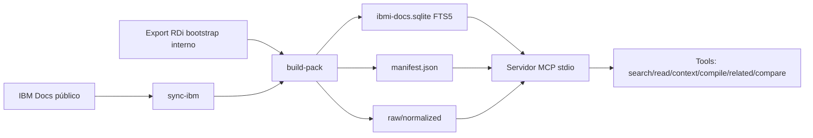

# Arquitectura MCP IBM i Docs

## Componentes principales

- `src/repository/CorpusRepository.ts`: búsqueda FTS5, ranking, contexto, related, compare, diagnostics.
- `src/server.ts`: tools/resources/prompts MCP.
- `src/cli.ts`: CLI de consulta, doctor, instalación de data packs y build.
- `src/ingest/packBuilder.ts`: normalización, curación, chunking estructural y SQLite.
- `src/pack/dataPack.ts`: instalación/archivo de data packs `.tgz`.

## Política de independencia

El endpoint RDi solo sirve para bootstrap durante desarrollo. No es dependencia de runtime, instalación ni sync público.

`sync-ibm` es un comando de CLI/build para mantenedores. La tool MCP `ibmi_docs_sync` no se registra
en runtime de usuario salvo que el operador defina explícitamente `IBMI_DOCS_ALLOW_NETWORK_SYNC=1`.
Las consultas de agentes deben entrar por `ibmi_docs_assist`, `ibmi_docs_resolve`,
`ibmi_docs_context` o tools de lectura/respuesta sobre el data pack local ya instalado.
