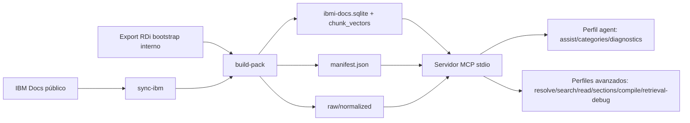

# Arquitectura MCP IBM i Docs

## Componentes principales

- `src/repository/CorpusRepository.ts`: recuperación semántica vectorial, contexto, related, compare, diagnostics.
- `src/server.ts`: tools/resources/prompts MCP.
- `src/cli.ts`: CLI de consulta, doctor, instalación de data packs y build.
- `src/ingest/packBuilder.ts`: normalización, curación, chunking estructural y SQLite.
- `src/pack/dataPack.ts`: instalación/archivo de data packs `.tgz`.

## Política de independencia

El endpoint RDi solo sirve para bootstrap durante desarrollo. No es dependencia de runtime, instalación ni sync público.

`sync-ibm` es un comando de CLI/build para mantenedores. La tool MCP `ibmi_docs_sync` no se registra
en runtime de usuario salvo que el operador defina explícitamente `IBMI_DOCS_TOOL_PROFILE=full` o
`maintainer` y además `IBMI_DOCS_ALLOW_NETWORK_SYNC=1`.

El perfil runtime por defecto es `agent`, que registra solo `ibmi_docs_assist`,
`ibmi_docs_categories` e `ibmi_docs_diagnostics`. Las consultas de agentes deben entrar por
`ibmi_docs_assist`; esa tool orquesta internamente `taskPlan`, intención, búsqueda, lectura,
secciones, follow-ups por gaps, síntesis y citas sobre el data pack local ya instalado.

El `taskPlan` clasifica familias de trabajo como creación de programas, diseño DDS, administración
de trabajos/locks, catálogo Db2 for i, diagnóstico de mensajes y revisión de código. Esa capa evita
que el agente cliente tenga que saber qué tool secundaria invocar o en qué orden. Los perfiles
`standard`, `full` y `maintainer` existen para clientes especializados o mantenedores que necesitan
inspeccionar el corpus y depurar ranking.
