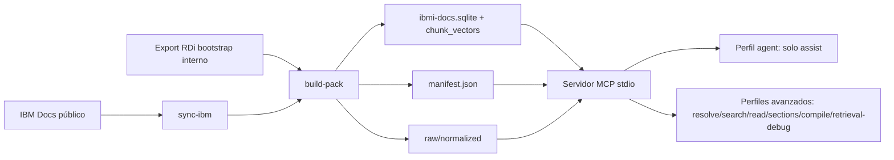

# Arquitectura MCP IBM i Docs

## Componentes principales

- `src/repository/CorpusRepository.ts`: recuperación semántica, selección de candidatos, lectura y composición de respuesta.
- `src/repository/neuralEmbeddings.ts`: carga local-only del Transformer E5 multilingüe afinado y
  generación de embeddings para facetas de título/ruta documental y contenido combinado.
- `models/ibmi-e5-base-finetuned-v1/`: bi-encoder E5-base de 768 dimensiones con pesos ONNX q8,
  tokenizer, licencia y manifest de entrenamiento. El
  ONNX se versiona en fragmentos menores de 100 MB. El release los distribuye en un asset separado y
  `postinstall.cjs` descarga por streaming, verifica SHA-256, reconstruye el modelo e instala la caché local; el banco de preguntas no se distribuye.
- `src/repository/neuralQueryHead.ts` y `models/ibmi-neural-query-head-v1/`: MLP residual
  obligatoria que proyecta cada consulta E5 al espacio documental. Se entrenó end-to-end contra
  los 7.027 vectores de documentos del pack y se valida por SHA-256; no contiene aliases, regex,
  clases de intención ni una ruta legacy.
- `models/ibmi-reranker-finetuned-v1/`: cross-encoder mMARCO MiniLM afinado y cuantizado para releer
  conjuntamente la pregunta y cada evidencia candidata.
- `src/repository/neuralReranker.ts`: carga local-only y ejecución del cross-encoder.
- `src/server.ts`: tools/resources/prompts MCP.
- `src/cli.ts`: CLI de consulta, doctor, instalación de data packs y build.
- `src/ingest/packBuilder.ts`: normalización, curación, chunking estructural y SQLite.
- `src/pack/dataPack.ts`: instalación/archivo de data packs `.tgz`.

## Contrato interno v2

`CorpusRepository` expone un único núcleo asíncrono: `search()` para exploración neuronal de bajo
nivel y `assist()` para respuesta one-shot. No existen rutas síncronas decorativas ni un motor
alternativo por coincidencias exactas. El hint de lenguaje, el código y las unidades lingüísticas
completas de una consulta se incorporan a las vistas del bi-encoder y del cross-encoder.

Las entradas públicas están acotadas antes de llegar al Transformer: 16.000 caracteres para
pregunta/consulta, 100.000 para código y 256 para etiquetas de lenguaje, versión o categoría. El
tokenizer mantiene su truncamiento por tokens, pero estos límites evitan multiplicar por varias
perspectivas un payload accidental de varios megabytes.

Los candidatos vectoriales se cachean con la identidad física y lógica del SQLite —dispositivo,
inode, tamaños, tiempos y generación del pack— y se invalidan cuando cambia. Toda ruta
`normalized_text_path` se valida contra la raíz física del data pack, exige un archivo regular e
incluye protección frente a symlinks/junctions.

El instalador descarga en streaming, limita bytes, rechaza links/rutas inseguras en los tar y
reemplaza packs/modelos con rollback. Un lock con propietario y heartbeat evita instalaciones
concurrentes; solo su propietario puede liberarlo.

La integridad del pack no termina en `ibmi-docs.sqlite`: `runtime-assets.json` publica también
`normalizedTreeSha256`, un hash agregado de rutas y contenidos normalizados. Una actualización
reutiliza el corpus únicamente si versión, SQLite y los 7.027 textos coinciden; si falta o cambia un
archivo, reinstala el pack completo de forma atómica.

`quality-report` aplica umbrales explícitos sobre integridad, volumen, duplicados exactos, tasa de
stubs, documentos cortos y cobertura mínima por release. Por tanto, `quality:check` es un gate de
calidad y no un alias cosmético de la verificación SQLite.

## Política de independencia

El endpoint RDi solo sirve para bootstrap durante desarrollo. No es dependencia de runtime, instalación ni sync público.

`sync-ibm` es un comando de CLI/build para mantenedores. La tool MCP `ibmi_docs_sync` no se registra
en runtime de usuario salvo que el operador defina explícitamente `IBMI_DOCS_TOOL_PROFILE=full` o
`maintainer` y además `IBMI_DOCS_ALLOW_NETWORK_SYNC=1`.

El perfil runtime por defecto es `agent` y registra únicamente `ibmi_docs_assist`. Tampoco anuncia
resources ni prompts diagnósticos. La tool ejecuta internamente un ensamble permanente entre la
geometría fundacional E5 y la proyección query→corpus, recuperación multi-faceta, reranking
cross-encoder, lectura y control de
relevancia. El resultado público contiene un solo bloque de texto con la respuesta final: no incluye
`structuredContent`, scores, IDs, planes, lecturas ni trazas.

Los objetos internos de diagnóstico siguen disponibles para tests, CLI con `--debug-json` y perfiles
`standard`, `full` o `maintainer`. Esta separación evita que un agente consumidor confunda
telemetría del buscador con la respuesta técnica solicitada.
