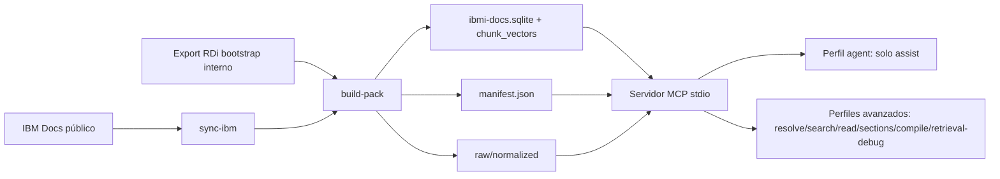

# Arquitectura MCP IBM i Docs

## Componentes principales

- `src/repository/CorpusRepository.ts`: recuperación semántica, selección de candidatos, lectura y composición de respuesta.
- `src/repository/neuralEmbeddings.ts`: embeddings E5 multilingües para recuperación inicial por
  faceta de título/ruta documental y por contenido combinado.
- `src/repository/neuralQueryAdapter.ts`: cabeza MLP residual aprendida que conserva la vista E5 base
  y añade una vista adaptada al modo en que la comunidad formula preguntas IBM i. El artefacto de
  `models/` no contiene ni distribuye el banco de preguntas.
- `src/repository/neuralReranker.ts`: cross-encoder BGE multilingüe para releer pregunta y pasajes conjuntamente.
- `src/server.ts`: tools/resources/prompts MCP.
- `src/cli.ts`: CLI de consulta, doctor, instalación de data packs y build.
- `src/ingest/packBuilder.ts`: normalización, curación, chunking estructural y SQLite.
- `src/pack/dataPack.ts`: instalación/archivo de data packs `.tgz`.

## Política de independencia

El endpoint RDi solo sirve para bootstrap durante desarrollo. No es dependencia de runtime, instalación ni sync público.

`sync-ibm` es un comando de CLI/build para mantenedores. La tool MCP `ibmi_docs_sync` no se registra
en runtime de usuario salvo que el operador defina explícitamente `IBMI_DOCS_TOOL_PROFILE=full` o
`maintainer` y además `IBMI_DOCS_ALLOW_NETWORK_SYNC=1`.

El perfil runtime por defecto es `agent` y registra únicamente `ibmi_docs_assist`. Tampoco anuncia
resources ni prompts diagnósticos. La tool ejecuta internamente recuperación E5 base + adaptada y
multi-faceta, reranking cross-encoder, lectura y control de
relevancia. El resultado público contiene un solo bloque de texto con la respuesta final: no incluye
`structuredContent`, scores, IDs, planes, lecturas ni trazas.

Los objetos internos de diagnóstico siguen disponibles para tests, CLI con `--debug-json` y perfiles
`standard`, `full` o `maintainer`. Esta separación evita que un agente consumidor confunda
telemetría del buscador con la respuesta técnica solicitada.
